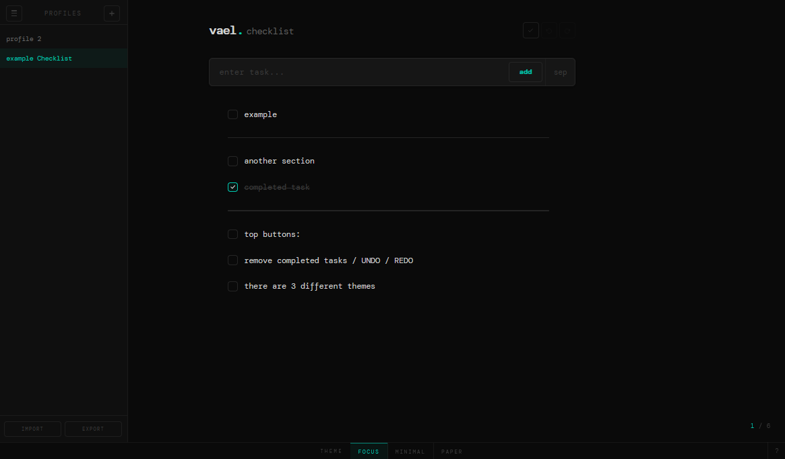
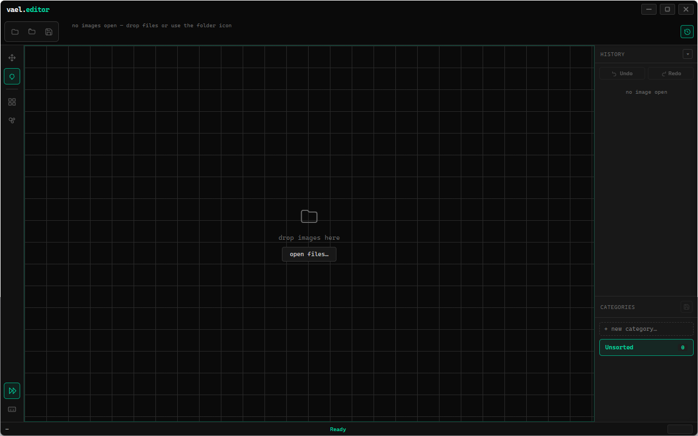
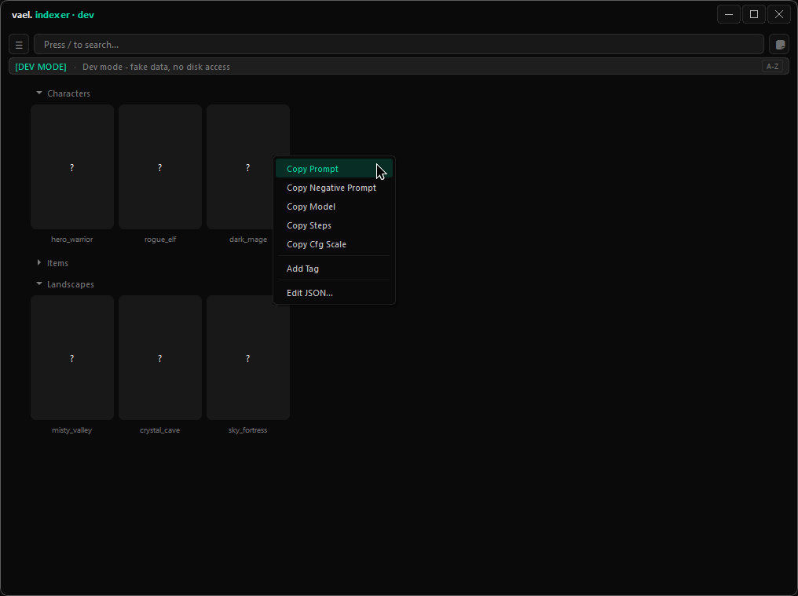
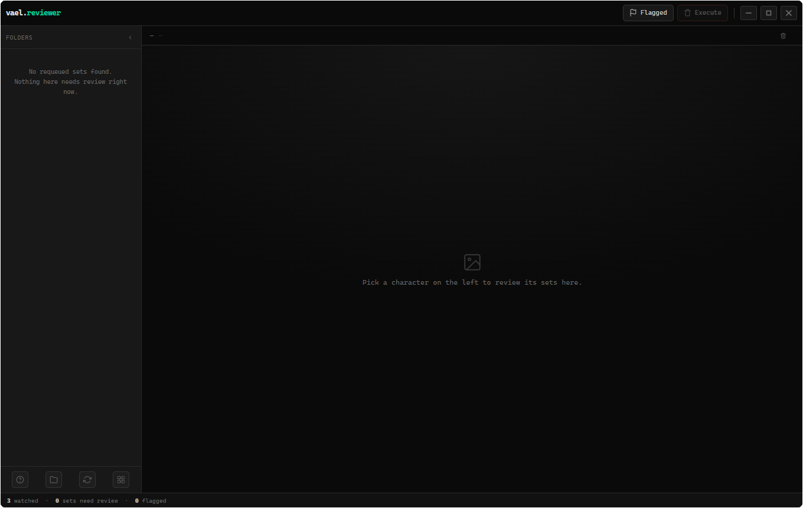

# vael.

<!-- cover -->

---

A small collection of minimal, single-purpose desktop tools. 
These apps are primarily built for myself to solve specific workflow challenges.

---

## the tools

### [checklist ›](./checklist/checklist.md)

A minimal to-do app for managing tasks with ease. Add, edit, reorder, and organize your tasks in a clean, distraction-free interface.

### [editor ›](./editor/editor.md)

A dark, workflow-specific image editor built for one job: pixelating or blurring parts of a large batch of images, fast.

### [indexer ›](./indexer/indexer.md)

A desktop app for browsing, searching, and editing structured data paired with visual assets — built for scanning folders of image + JSON pairs (e.g. AI-generated images with their prompt/tag metadata) into a fast, searchable visual library. Windows and Linux, with partial Wayland support.

### [reviewer ›](./reviewer/reviewer.md)

An image reviewer built to find and resolve requeued ComfyUI image sets. Point it at your output folders and it groups regenerated iterations of the same image together so you can quickly decide what to keep and what to trash.

---

## contributing

Issues and pull requests are welcome. Please open an issue before submitting larger changes.

---

## license

All projects in this collection are licensed under [Creative Commons Attribution-NonCommercial 4.0 International (CC BY-NC 4.0)](https://creativecommons.org/licenses/by-nc/4.0/).

You are free to use, share, and adapt this software for non-commercial purposes, provided appropriate credit is given. Commercial use is not permitted.

---

## disclaimer

These apps are provided as-is, without warranty of any kind. The developer makes no guarantees regarding data integrity, loss, or corruption. You are solely responsible for any data you enter, store, or manage using these applications, and for any consequences arising from their use. Use at your own risk.
