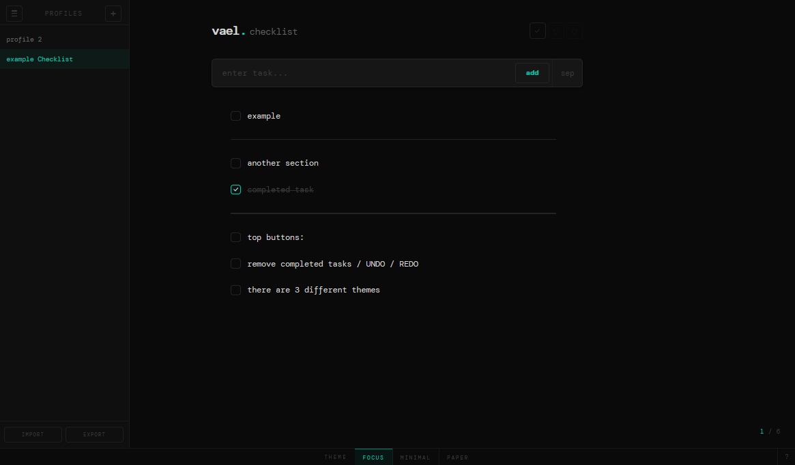

# checklist

<!-- cover -->


---

A minimal to-do app for managing tasks with ease. Add, edit, reorder, and organize your tasks in a clean, distraction-free interface.

---

## features

- tasks — add, check off, edit in-place, delete
- separators to group tasks into sections
- drag-to-reorder
- list undo / redo (Ctrl+Z / Ctrl+Y or Ctrl+Shift+Z); text fields retain native text undo
- profiles — save named snapshots of your list, switch between them from the sidebar
- import / export your list as a `.json` file
- two built-in themes: *dark* and *white*, with offline system fonts
- automatic recovery of unnamed drafts and unfinished task input
- recovery of the 20 most recently deleted profiles
- zero dependencies — one self-contained `.html` file

---

## getting started

Just open `vael.html` in any browser, or drop it on a static file server. Works entirely offline.

Saving requires browser support for Web Locks. If that capability is unavailable, the app shows an explanation and remains view-only. Local-file behavior was verified in Chromium on Windows; other browsers and hosting configurations have not been verified.

## saving and recovery

An open profile saves each committed change automatically. An unnamed list and the task input are saved as a recovery draft. On reload, a recovery draft takes priority over the starred startup profile. Opening another profile or importing a list asks before discarding an unsaved list or unfinished input, including a list you deliberately emptied.

Inline task, header, and note edits commit on blur or Enter. Escape cancels that edit. Closing or hiding the page commits the active inline edit; an abrupt process crash can still lose text that had not yet committed. Undo/redo history is session-only.

Storage errors remain visible. Failed saves keep the current list in memory; unreadable stored data is preserved instead of being replaced with defaults. Keep the tab open and export the list before attempting recovery or clearing browser data. The browser may also warn before leaving when the recovery draft could not be saved.

Deleting a profile retains a recovery copy. Use **restore deleted** at the bottom of the sidebar to restore the latest deletion; repeat to restore earlier ones. Recovery survives reloads and retains at most 20 deleted profiles. Deleting the open profile also leaves its visible list as an unnamed draft. Browser-data deletion removes these recovery copies too.

## multiple tabs

One tab holds editing access. Additional tabs can browse and export, display updates from the editing tab, and show a view-only notice. When the editing tab closes or reloads, a waiting tab can receive editing access and reload the latest saved state. This prevents competing autosaves from overwriting each other. Coordination applies to tabs using this version and the same browser storage; an older open version does not participate.

## import and export

Export downloads the current list, including its tasks, separators, headers, and notes. It does not back up every profile, settings, deleted profiles, undo history, or unfinished task-input text.

Import accepts that export object or a raw item array. It validates types and status fields before changing the list, assigns fresh item/note IDs, and rejects malformed data with an explanation. Limits are 5 MiB per file, 10,000 top-level items, 10,000 notes per task, and 100,000 characters per text field. These are validation limits, not a performance guarantee for very large lists. Imported lists become unnamed drafts; they do not overwrite an existing profile automatically.

---

## file structure

```
vael.html      — the entire app (HTML + CSS + JS)
icon.png       — favicon
cover.png      — cover image used in this readme
```

---

## local data

Saved data lives in your browser's `localStorage` for the page. The browser manages persistence on disk; the HTML file and source folders are not rewritten. No account or remote sync is involved. Moving the HTML file, changing browser profiles, or using another site address may expose a different storage area.

- `vael_settings` — your selected theme
- `vael_profiles` — your saved profiles (each a named snapshot of your task list)
- `vael_draft` — recovery copy of the current unnamed/unsaved list and unfinished task input

`vael_profiles` also retains deleted-profile recovery copies. Older `vanta_settings` and `vanta_profiles` keys are migrated when the corresponding new key is absent. Invalid saved data is not silently overwritten.

## verification

Ten local regression checks passed using isolated, offscreen Electron/Chromium windows on Windows. Checks cover malformed imports through the actual file-reader path, IDs and literal text rendering, full/blocked storage, corrupt data, draft reloads, text/list undo, immediate clearing, deleted-profile recovery, two-window coordination, offline resources, and both themes. Dark and white screenshots were visually inspected. The regression script stays outside the repository. Firefox, Safari, mobile browsers, abrupt power loss, and production-size lists were not verified.
