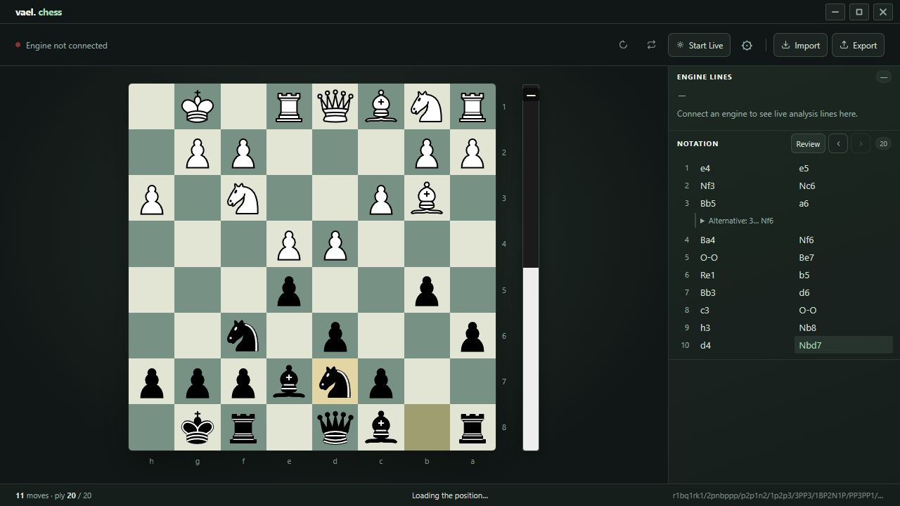

# chess

<!-- cover -->


---

A desktop chess board for exploring positions and reviewing games with a local analysis engine. It shares Vael's quiet, dark interface.

---

## features

- move pieces on an interactive board with legal-move checking
- step backward and forward through a game's move history
- flip the board and start a fresh position
- import a position as FEN or a game as PGN — standard chess text formats
- export a game as PGN text to copy and keep
- connect a locally installed Stockfish engine for live evaluation and suggested lines
- adjust engine strength, analysis limits, and resource settings
- mirror a Lichess or Chess.com browser board using the included Chrome/Edge/Zen/Firefox companion
- read logical piece identities and squares independently of piece artwork, board colors, size, and orientation
- keep screen capture as an experimental fallback for other windows

---

## installation & removal

**Install on Windows**

1. Install [Python](https://www.python.org/downloads/). Enable **Add Python to PATH** if the installer offers it.
2. Download Vael using **Code → Download ZIP** on GitHub, then extract it.
3. Open the `chess` folder and double-click `start.bat`. It downloads the required packages into a local `venv` folder and opens the app. Allow time for the initial setup.
4. For engine analysis, download and extract [Stockfish](https://stockfishchess.org/download/). In Chess's top-bar Engine settings, choose **Browse**, select the Stockfish executable, then **Connect**.

Use `start.bat` for first-time setup or manual dependency maintenance. It prepares the environment, upgrades pip, installs required packages, and opens the app with console output. Setup needs internet access.

Use `start_silent.bat` for everyday launches, including through Rovyl. It uses the installed environment and Python's windowless interpreter directly, without activation, dependency checks, or updates. If setup is missing, it asks you to run `start.bat`. If the app fails to open, run `start.bat` to see the error. Silent application errors go to `logs/desktop.log`. Engine and review subprocesses also run without consoles on Windows. A browser alone cannot run this app's Python and engine functions.

**Uninstall**

Close Chess and delete its `chess` folder, including the generated `venv` folder. Save any game you want to keep using PGN export first. Stockfish is installed separately; delete its extracted folder separately if you no longer need it.

---

## local data

- `.vael_chess_settings.json`, beside `app.py`, stores the selected engine path and engine options. The leading dot is part of its name.
- Optional custom piece images live under `piece_templates/` in the Chess folder.
- The board, variations, selected position, board preferences, paused Live position, and review results are restored from `.vael_chess_session.json`, with an atomic save and backup. Export PGN for a portable copy.
- Screen capture is processed locally; the selected region is used to recognize the board.
- Browser Live listens only on `127.0.0.1:18765` while active, using a saved pairing code. The extension sends board positions and notation to this local receiver. It reads only the tab you explicitly connect; no credentials, cookies, or browsing history are read.

## browser Live

1. Click **Live** in Vael, then **Connect** in its compact panel.
2. Load the companion from the `browser-extension` folder beside `app.py`. The setup dialog provides the full folder path:
   - **Zen / Firefox:** enter `about:debugging#/runtime/this-firefox` in the browser address bar, choose **Load Temporary Add-on…**, and select `browser-extension/firefox/manifest.json`. Load it again after a browser restart. Permanent installation requires a Mozilla-signed release, which is not included.
   - **Chrome / Edge:** open the extension manager, enable Developer mode, choose **Load unpacked**, and select the `browser-extension` folder. If already installed, use its **Reload** button after updating these files.
3. Open a single game board on Lichess or Chess.com. Click **Vael Chess Live** in your browser's extensions, paste the pairing code, and connect. Allow local access and access to the supported chess sites so the companion can reconnect after a page refresh. The extension stores the paired game URL and connection details locally.
4. The bottom activity bar shows connection and action status. While Live is active, hover over the toolbar Live button for a row of icon controls; hover an icon for its label. Click Live or press Down Arrow on it to open the controls by keyboard, and Escape to close. The copy icon copies the current pairing code. **Pause & explore** lets you navigate and create variations while browser updates continue in the background. **Return to live** follows the latest position. **Stop** fully disconnects and clears the pairing code and browser ownership. Starting again, **Reconnect**, or **Switch browser/tab** creates a fresh code that you paste into the extension. Every app launch starts disconnected. Starting Live opens Pairing & setup unless its “Do not show when starting Live” checkbox is selected. Reconnect creates a fresh code and copies it without opening setup.

Browser Live uses site metadata, not screenshot templates. Lichess's visible game notation reconstructs turn, castling, and en-passant rights and is checked against the displayed pieces. Keep its move list available. Chess.com uses the board's full FEN when available; logical piece classes provide a fallback for a known position. For a custom position or a page without complete notation/FEN, import the exact source FEN before connecting. Incomplete readings leave the last board intact and show what is needed.

This supports standard chess. Chess variants are not supported. Page structure changes may require updating the reader. The paired game reconnects after a tab refresh while Live remains running. When the installed extension persists across browser restarts, the same game URL can reconnect there too. Temporary Zen/Firefox installations still need to be loaded again. A different game must be connected explicitly. The companion supports desktop Chrome/Edge 121+ and Zen/Firefox based on Firefox 128+, not native mobile apps. Screen capture remains experimental and cannot guarantee arbitrary piece-set recognition.

---

## exploration and review

Playing a different move from an earlier position creates a variation instead of erasing the original continuation. Expand branches in Notation and export them with PGN. The previous workspace restores when the app opens.

After stopping Live, choose **Review** beside Notation, then **Analyse game**. The local engine compares candidate moves and the played move; costly decisions receive a deeper check. Allow roughly 1–5 seconds per move, depending on the position and computer. You can cancel and keep partial results.

The summary shows separate White and Black accuracy estimates, a move-quality breakdown, and optional phase scores. Choose **Start review** for a chronological tour of strong decisions and costly mistakes, or choose any analysed move from the graph, slider, or move list. You can filter highlights to one side. The score is Vael's own estimate, not Elo or Chess.com's formula; short games and shallow searches deserve caution.

Before each move, a green arrow shows the preferred move and a dashed amber arrow shows the played move. **Try …** previews the preferred position; the continuation buttons step through the engine's replies. **Played move** compares the original choice and its engine continuation. These previews never change your saved game or variations, and closing Review restores your original position. Review arrows remain visible independently of the normal engine-arrow setting.

Explanations use verified board facts and engine lines. The system assigns Great, Best, Excellent, Good, Inaccuracy, Mistake, Blunder, and Forced; it does not invent Brilliant labels or human skill ratings. See `docs/review-roadmap.md` for the scoring method and remaining work.

## file structure

```text
app.py                — small desktop entry point, including windowless logging
backend/              — Python application code
  application.py      — desktop bridge, board actions, settings, and startup
  paths.py            — project paths shared by backend modules
  engine.py           — continuous engine analysis
  engine_process.py   — platform-specific engine process options
  review.py           — game review and move explanations
  study.py            — variation tree and saved-session storage
  browser_live.py     — authenticated local browser connection
  capture.py          — experimental screen-board recognition
frontend/             — interface HTML, CSS, JavaScript, and piece artwork
browser-extension/    — Chrome/Edge companion and generated Firefox package
docs/review-roadmap.md — scoring method and unfinished review refinements
requirements.txt      — Python dependencies
start.bat             — Windows setup and windowless launch
start_silent.bat      — compatibility shortcut to start.bat
README.md              — this guide
icon.png / .ico       — app icons
```

### Review refinements

Use **Check deeper** on a move for a three-second search per candidate, then **Check further** for six seconds. Cancelling keeps the previous verdict. **See the threat and reply** jumps to concrete positions in the analysed lines without changing your game.

A completed connected game offers **Review this game** in the Live toolbar menu. It stops Live and starts the review; dismissing the offer keeps it quiet. Checkmate and automatic draws are detected from the board. Resignations and clock results depend on the site's visible result data; detection was checked with fixtures before the test-suite cleanup but has not been verified against every current site layout or language.

The Chrome/Edge extension uses the root `browser-extension` folder. Zen/Firefox uses the generated `browser-extension/firefox` package. After editing shared companion sources, run `python browser-extension/build_firefox.py`. Regenerate the Firefox package whenever shared extension files change.

Engine settings are available from the top-bar gear. The sidebar contains only Engine Lines and Notation, always expanded. Each recommended line reserves two text lines and clips longer continuations. The Windows window uses `icon.ico` and a dedicated taskbar app identity; other platforms use `icon.png`, also used as the browser favicon. The in-app title bar stays text-only.

Notation uses compact rows with a move-number column and aligned White/Black moves; alternatives remain expandable beneath the relevant move pair.

The test suite and its preview/calibration fixtures have been removed. Local settings, saved sessions, templates, and logs remain at the project root so existing installations retain their data.
