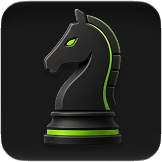

# chess

<!-- cover -->


---

A desktop chess board for exploring positions and reviewing games with a local analysis engine. It shares Vael's quiet, dark interface.

---

## features

- move pieces on an interactive board with legal-move checking
- step backward and forward through a game's move history
- flip the board and start a fresh position
- import a position as FEN or a game as PGN — standard chess text formats
- export a game as PGN text to copy and keep
- connect a locally installed Stockfish engine for live evaluation and suggested lines
- adjust engine strength, analysis limits, and resource settings
- mirror a Lichess or Chess.com browser board using the included Chrome/Edge/Zen/Firefox companion
- read logical piece identities and squares independently of piece artwork, board colors, size, and orientation
- keep screen capture as an experimental fallback for other windows

---

## installation & removal

**Install on Windows**

1. Install [Python](https://www.python.org/downloads/). Enable **Add Python to PATH** if the installer offers it.
2. Download Vael using **Code → Download ZIP** on GitHub, then extract it.
3. Open the `chess` folder and double-click `start.bat`. It downloads the required packages into a local `venv` folder and opens the app. Allow time for the initial setup.
4. For engine analysis, download and extract [Stockfish](https://stockfishchess.org/download/). In Chess's engine panel, choose **Browse**, select the Stockfish executable, then **Connect**.

Use `start.bat` again to launch later. `start_silent.bat` is the alternate launcher without the normal console window. The launchers may contact the internet to check dependencies. A browser alone cannot run this app's Python and engine functions.

**Uninstall**

Close Chess and delete its `chess` folder, including the generated `venv` folder. Save any game you want to keep using PGN export first. Stockfish is installed separately; delete its extracted folder separately if you no longer need it.

---

## local data

- `.vael_chess_settings.json`, beside `app.py`, stores the selected engine path and engine options. The leading dot is part of its name.
- Optional custom piece images live under `piece_templates/` in the Chess folder.
- The board, variations, selected position, board preferences, paused Live position, and review results are restored from `.vael_chess_session.json`, with an atomic save and backup. Export PGN for a portable copy.
- Screen capture is processed locally; the selected region is used to recognize the board.
- Browser Live listens only on `127.0.0.1:18765` while active, using a saved pairing code. The extension sends board positions and notation to this local receiver. It reads only the tab you explicitly connect; no credentials, cookies, or browsing history are read.

## browser Live

1. Click **Live** in Vael, then **Connect** in its compact panel.
2. Load the companion from the `browser-extension` folder beside `app.py`. The setup dialog provides the full folder path:
   - **Zen / Firefox:** enter `about:debugging#/runtime/this-firefox` in the browser address bar, choose **Load Temporary Add-on…**, and select `browser-extension/manifest.json`. Load it again after a browser restart. Permanent installation requires a Mozilla-signed release, which is not included.
   - **Chrome / Edge:** open the extension manager, enable Developer mode, choose **Load unpacked**, and select the `browser-extension` folder. If already installed, use its **Reload** button after updating these files.
3. Open a single game board on Lichess or Chess.com. Click **Vael Chess Live** in your browser's extensions, paste the pairing code, and connect. Allow local access and access to the supported chess sites so the companion can reconnect after a page refresh. The extension stores the paired game URL and connection details locally.
4. The Live panel shows connection and sync status. **Pause & explore** lets you navigate and create variations while browser updates continue in the background. **Return to live** follows the latest position. **Stop** disables automatic startup; **Switch browser/tab** creates a new pairing code.

Browser Live uses site metadata, not screenshot templates. Lichess's visible game notation reconstructs turn, castling, and en-passant rights and is checked against the displayed pieces. Keep its move list available. Chess.com uses the board's full FEN when available; logical piece classes provide a fallback for a known position. For a custom position or a page without complete notation/FEN, import the exact source FEN before connecting. Incomplete readings leave the last board intact and show what is needed.

This supports standard chess. Chess variants are not supported. Page structure changes may require updating the reader. The paired game reconnects after refresh or an app restart. When the installed extension persists across browser restarts, the same game URL can reconnect there too. Temporary Zen/Firefox installations still need to be loaded again. A different game must be connected explicitly. The companion supports desktop Chrome/Edge 121+ and Zen/Firefox based on Firefox 128+, not native mobile apps. Screen capture remains experimental and cannot guarantee arbitrary piece-set recognition.

---

## exploration and review

Playing a different move from an earlier position creates a variation instead of erasing the original continuation. Expand branches in Notation and export them with PGN. The previous workspace restores when the app opens.

After stopping Live, choose **Review** beside Notation to run a quick Stockfish review. Its graph, largest evaluation drops, and suggested alternatives are available on demand. Move grades and natural-language explanations are planned in `review-roadmap.md`; the quick estimates are not definitive grades.

## file structure

```text
app.py                — desktop app, board rules, and saved settings
engine.py             — connection to the chess analysis engine
capture.py            — recognition of boards in a selected screen area
browser_live.py       — authenticated local browser connection and position validation
browser-extension/    — Chrome/Edge/Zen/Firefox companion
frontend/index.html   — the visible interface
frontend/style.css    — colors and layout
frontend/app.js       — board controls and interactions
frontend/pieces.js    — piece artwork
requirements.txt      — packages needed by the app
start.bat             — Windows setup and launch
start_silent.bat      — alternate Windows launcher
chess.md              — this guide
icon.png / .ico       — app icons
```
