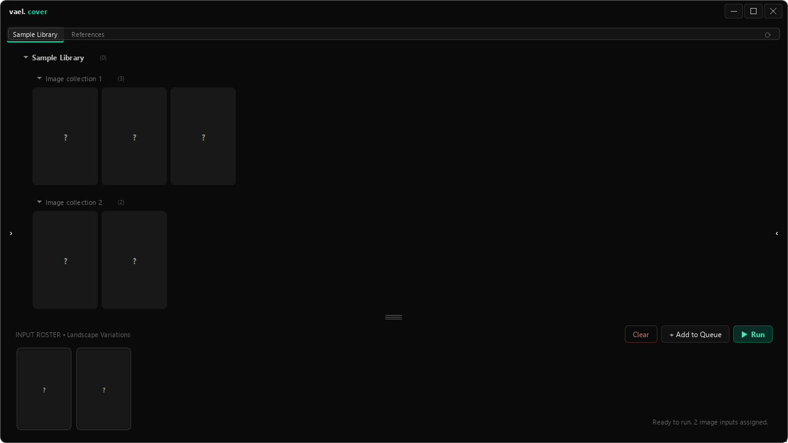

# cover

<!-- cover -->


---

A desktop companion for ComfyUI. Browse your image folders, assign inputs to saved workflows, and run individual jobs or a queue from one compact workspace.

---

## features

- keep several ComfyUI workflows available and switch between them
- browse local image folders with thumbnails and a larger image viewer
- assign images to workflow input slots through the Input Roster
- adjust exposed workflow parameters before running
- run one workflow or process queued jobs in order
- retry failed jobs and check jobs whose server status is still pending
- reconnect to submitted jobs without automatically submitting duplicates
- browse generated PNGs in a chosen local output folder
- move selected output files, or all PNGs in that folder, to the system trash
- background output scanning and thumbnail loading
- keyboard shortcuts for workflows, folders, queue actions, and sidebars
- save workflow settings and the window layout between launches

---

## installation & removal

**Install**

1. Install [Python](https://www.python.org/downloads/). Enable **Add Python to PATH** if the installer offers it.
2. Download Vael using **Code → Download ZIP** on GitHub, then extract it.
3. Open the `cover` folder. On Windows, double-click `start.bat`. On Linux, open a terminal in this folder and run `bash start.sh`.
4. Wait while the launcher creates a local `venv` folder, downloads the required packages, and opens the app.

On Windows, use `start.bat` for first-time setup or manual dependency maintenance. It prepares the environment, upgrades pip, installs required packages, and opens the app with console output. Setup needs internet access.

After setup, use `start_silent.bat` for everyday launches, including through Rovyl. It uses the installed environment directly, without activation, dependency checks, or updates. If setup is missing, it asks you to run `start.bat`. If the app fails to open, run `start.bat` to see the error. Silent launches no longer create timestamped launcher logs. Linux launchers are unchanged.

ComfyUI must be installed and running separately. In Cover's Settings, enter its server address and choose the local output folder to browse. Add workflows exported in ComfyUI's **API format**; Cover does not install the models or extra nodes they require.

**Uninstall**

Close Cover and delete its `cover` folder, including `venv`. Move any workflow files or output images you have kept inside that folder somewhere safe first. ComfyUI and image folders elsewhere are separate from this installation.

---

## usage

### prepare a compatible workflow

Cover is designed around **ComfyUI workflows that take one or more image inputs and produce a single final image per run**. Prepare and try the workflow in ComfyUI first, with its models and custom nodes installed on the server.

- Export the workflow as **API-format JSON**, not the ordinary editor-layout JSON. Cover needs the executable node information.
- Use the standard **Load Image** (`LoadImage`) or **Load Image Mask** (`LoadImageMask`) nodes for inputs you want to assign in Cover. These become the Input Roster's slots; custom image-loading nodes are not automatically recognized.
- Connect the workflow to a **Save Image** node to keep the result on disk. A preview alone does not put a saved image in Cover's output folder.
- Keep the workflow focused on the intended single-image result. Cover checks that ComfyUI produced an image, but it does not enforce exactly one output or choose among multiple outputs for you.

### folder workflows and settings

Settings has three sections that start collapsed: **Image Selection**, **Ignored Folder Names**, and **Folder Workflows**. Click a section to expand it; hover over the small **?** beside a label for help.

In **Folder Workflows**, click **Add Rule**, type a folder-name pattern, and choose an existing workflow. Each `[]` stands for any non-empty text (including numbers, spaces, or punctuation). Everything outside the placeholders is literal; matching covers the entire folder name and ignores letter case. A leading dot is optional for promotion folders.

| Pattern | Example folder |
| --- | --- |
| `[]-[]_[]` | `Fantasy-Alice_Beach` |
| `[];[]` | `Alice;Fantasy` |
| `[]-OC_[]p` | `20261005-OC_20p` |
| `[]-OC_[]p-[]` | `20261005-OC_20p-2` |
| `Favorites` | `Favorites` (exact name) |

Rules run from top to bottom; the first matching rule with an available workflow wins. Use **Move Up / Move Down** to put specific patterns above broader ones, and **Remove** to delete a selected rule. Type a folder name into the preview field to see which workflow would be selected. Click **Save** to keep changes; **Close** discards them. Existing preset assignments are converted to editable patterns.

Opening a matching folder, including with the sibling-folder shortcuts, selects its assigned workflow. Unmatched folders keep the current workflow. This only selects the workflow; image inputs and running jobs are unchanged. Assignments survive workflow reordering and edits. Deleted workflows appear as unavailable and their rules are skipped until reassigned.

### load and run

1. Start ComfyUI. In Cover's **Settings**, enter that server's address and select the local output folder you want to browse.
2. Create a workflow entry and choose its exported API JSON file.
3. If needed, enter one node's **ID or title** in the optional extra-fields setting. Cover exposes that node's plain text and number values; connected inputs and on/off values are not editable through these controls.
4. Assign an image to every detected input slot in the **Input Roster**. Cover uploads those images to ComfyUI when submitting the job.
5. Choose **Run**, or **Add to Queue** and then **Run Queue** for several prepared jobs.

ComfyUI's Save Image node controls where results are written. Cover's Outputs panel browses PNGs directly inside the configured local folder; choose a matching folder and refresh it to see results. A remote ComfyUI server's output needs to be accessible locally, such as through a mounted shared folder—Cover does not download it automatically.

Use **Retry Failed** for failed queue jobs and **Check Pending** to reconnect to submitted jobs. If a submission is marked **unknown**, check ComfyUI before submitting it again: the server may already be running it.

---

## local data

- `workflows_config.json`, beside `app.py`, stores settings, workflow references, parameter values, and layout.
- Workflow JSON files and input images stay wherever you put them; the app remembers their locations.
- Generated images are saved by ComfyUI. Cover's output-folder setting selects a local folder to browse; it does not change where ComfyUI saves or download remote results.
- Queue entries, submitted-job IDs, and assigned input images last only for the current session.

Closing Cover stops its local monitoring. Jobs already submitted can continue on ComfyUI.

---

## file structure

```text
app.py                       — the desktop app
requirements.txt             — packages needed by the app
start.bat / start.sh          — Windows / Linux setup and launch
start_silent.bat / .sh        — alternate launchers
README.md                     — this guide
icon.png / .ico               — app icons
workflows_config.json        — your saved settings; created locally
venv/                        — downloaded Python packages; created by the launcher
```
