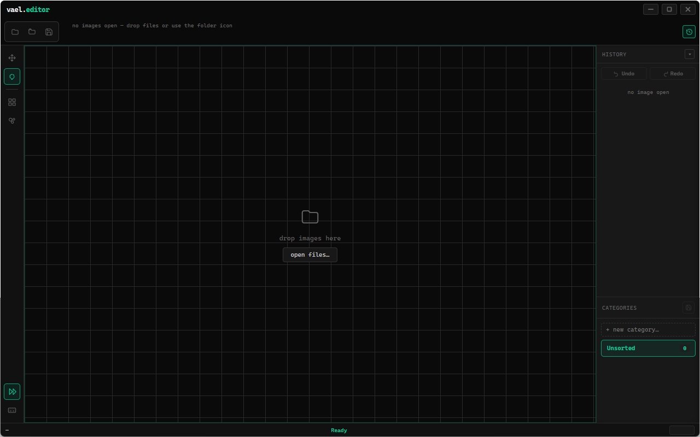

# editor

<!-- cover -->


---

A dark, workflow-specific image editor built for one job: pixelating or blurring parts of a large batch of images, fast. Desktop app (Electron), Windows and Linux.

---

## features

- **pixelate** and **bokeh blur** tools, each with adjustable strength and savable presets
- rectangle, ellipse, and lasso selection — additive (`Ctrl`+drag) and subtractive (`Shift`+drag)
- **batch folder import** — drop or open a whole folder and it becomes its own category
- **categories** to sort open images into buckets, drag thumbnails between them, save a whole category at once
- per-image undo/redo (up to 40 history steps), retained when images leave memory
- auto-advance to the next image after saving
- multi-select thumbnails for batch pixelate/blur; filters run sequentially across the selected images
- built-in image metadata viewer (EXIF, dimensions, etc.)
- hide-all-ui mode for a distraction-free canvas
- assignable custom hotkeys for your saved filter presets

---

## installation

to be expanded

---

## getting started

Launch the app, then either drag images/folders onto the canvas or use the open-file / open-folder buttons in the top bar. Pick a tool, make a selection, apply a filter from the left toolbar, and save.

Folder imports discover filenames first and show their categories before generating previews. When one drop creates multiple categories, Editor selects the first image in the topmost nonempty category and returns its filmstrip to the beginning, ready for top-to-bottom auto-advance.

Two background workers load previews, prioritizing the category currently shown in the filmstrip. The status bar shows overall preview progress and a failure count. You can edit immediately while the remaining previews load, including when the window is minimized. Completing previews does not change your current image or overwrite edited thumbnails. Unreadable images stay listed; selecting one attempts to open the original and reports failure if it cannot be read.

Folder scope is unchanged: direct images plus images in immediate subfolders, grouped into one category per dropped folder. Full editing pixels are loaded on selection. Thumbnail decoding uses at most two concurrent jobs, but large source images still require temporary decoder memory; this is not a total-process memory cap.

There is a full list of hotkeys (including any custom preset hotkeys you've assigned) available in-app via the hotkey guide button in the toolbar.

---

## saving and metadata

The save-options button beside Save controls JPEG/WebP quality, the JPEG background color, and source metadata handling. Options apply to all saves in the current session.

- The destination extension selects the actual encoding: `.png`, `.jpg`/`.jpeg`, or `.webp`. Other imported formats require Save As to a supported output format.
- PNG and WebP retain transparency. JPEG fills transparent areas with the selected background color (white by default). JPEG/WebP quality defaults to 92%.
- **Remove source metadata** is the default. Source EXIF, GPS tags, embedded previews, and text are not copied into the output. The encoder can still write its own format information.
- **Keep PNG text** copies the original PNG's `tEXt`, `zTXt`, and `iTXt` chunks unchanged, including ComfyUI prompts/workflows. Both source and output must be PNG. It does not copy EXIF, orientation, color-profile, or preview chunks; text content itself is copied verbatim. Unsupported formats or damaged PNG chunks stop the save with an explanation.
- **Show original metadata** always examines the image as it was opened, even after edits, Save As, or memory eviction. It does not describe the metadata in the latest export.

A successful save records the exact pixel revision. Undoing and branching into a different edit correctly marks it unsaved, even if it reuses the same history position. Selection-only actions do not count as changed pixels. Cancelling or failing a save keeps unsaved edits and does not auto-advance.

Saves write and flush a temporary sibling file, then publish it. Existing destinations are checked against the content read when the image was opened (or chosen in Save As). If the file changed or disappeared, saving stops: use Save As for a separate copy, or reopen the source. Within one app instance, writes to the same path are serialized. The final check and replacement are not a cross-application file lock; another program can still race that narrow interval. An unsupported filesystem replacement fails instead of falling back to truncating the original.

## memory and session history

Editor targets a 256 MiB budget for retained canvases, history buffers, masks, encoded previews, and thumbnails. Shared history buffers are counted once. It moves older history and inactive images into private temporary session files, then restores them on demand. Browsing away from an image no longer removes its undo/redo history.

The active image needs a working canvas, and Chromium, codecs, and filter workers need additional temporary memory, so this is not a hard limit on process RAM. Filter allocations are estimated before starting; operations estimated to exceed 1 GiB are rejected with an explanation. Oversized editing canvases are also rejected. Cache write failures retain working data rather than discard edits.

Closing an image releases its buffers and session files. Normal application exit removes the session cache; a crash may leave temporary files in the OS temporary directory. These files are scratch storage, not restart recovery. The desktop Electron app provides disk-backed history; opening the HTML alone does not provide that cache or PNG-text retention.

## verification

Local regression checks covered batch-blur dispatch, saved-history branching, real Electron PNG/JPEG/WebP encoding, save cancellation, undo/redo after eviction, a forced small memory budget, stale-file conflicts, and PNG metadata policies. Filesystem failure tests simulated disk-full and publication failures and checked that the original bytes survived. Save-option layout was inspected in offscreen Electron.

The checks live outside the repository. These runs used Windows and small image fixtures; they do not establish peak RAM on production-size libraries, Linux filesystem behavior, or power-loss durability.

---

## file structure

```
editor.html          — the app's UI, styling, and all renderer-side logic
main.js               — Electron main process: window, native dialogs, filesystem I/O
image-files.js         — format checks, source versions, and atomic file publication
image-metadata.js      — validated PNG text copying
session-cache.js       — private temporary history/pixel storage
preload.js             — exposes a minimal, safe electronAPI bridge to the renderer
package.json            — app metadata and electron-builder configuration
package-lock.json         — locked dependency tree
icon.png               — app / taskbar icon
cover.png              — cover image used in this readme
```

---

## local data

Nothing autosaves. Open images, categories, and edit history belong only to the current session (some buffers are temporarily stored on disk) — closing the app without saving discards them. Edited images are only written to disk when you explicitly **Save** or **Save As**, to wherever you choose via the native file dialog.

The one thing the app does persist locally is your saved filter presets (pixelate/blur values and any hotkeys you've assigned to them), under the key `vael-editor-presets` in the window's local storage. That lives inside Electron's per-app data folder:

- **Windows:** `%APPDATA%\editor.\Local Storage\`
- **macOS:** `~/Library/Application Support/editor./Local Storage/`
- **Linux:** `~/.config/editor./Local Storage/`

This is Chromium's internal storage format (not a plain-text file) — it isn't meant to be edited by hand.
