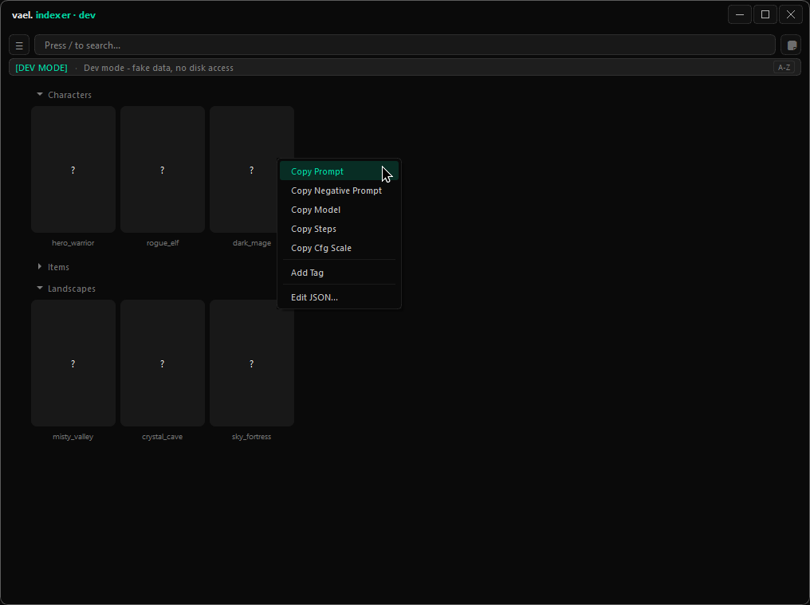

# indexer

<!-- cover -->


---

A desktop library for images and their accompanying information. Turn folders of image + JSON pairs into a searchable visual collection, with quick access to tags, notes, and reusable text.

---

## features

- index PNG images with matching JSON information files
- group results into collapsible folders and subfolders
- refresh libraries without rebuilding unchanged entries
- search by filename, folder, JSON content, or identifier
- combine several searches with semicolons; show matching images once
- view all results in one continuous list
- browse thumbnails and open a larger image viewer
- drag image files into other applications
- copy individual information fields, add tags, and edit image or folder information
- organize images with persistent or temporary identifiers
- keep reusable notes in optional categories
- switch between several indexed libraries
- run configured Python scripts on startup or reload, with cancellation and error reporting
- background searching, scanning, and preview loading
- scroll expanded folders and note sections into view

---

## installation & removal

**Install**

1. Install [Python](https://www.python.org/downloads/). Enable **Add Python to PATH** if the installer offers it.
2. Download Vael using **Code → Download ZIP** on GitHub, then extract it.
3. Open the `indexer` folder. On Windows, double-click `start.bat`. On Linux, open a terminal in this folder and run `bash start.sh`.
4. Wait while the launcher creates a local `venv` folder, downloads the required packages, and opens the app.

Use the same launcher each time. Internet access is needed when it installs or updates packages. The `start_silent` variants are alternate launchers without the normal console output.

Use **Add Folder** in the app to choose a library. Each indexed image needs a matching `.json` file containing its information. Indexer does not generate missing information files automatically.

**Uninstall**

Close Indexer and delete its `indexer` folder, including `venv`. For a complete reset, also remove the `.vael_indexer` data folder below after saving any notes you want to keep. Your image library is separate; keep it when removing the app.

---

## usage

### prepare the images and their information

Indexer needs **readable JSON files alongside your images**. A JSON file is a plain-text file containing named fields and their values. For example, `portrait.png` needs `portrait.json` in the same folder. Add their parent folder through **Add Folder**; its subfolders are scanned too.

**A note from the contributor:** I use a separate script in my own setup to automatically extract the data and write it straight into the matching JSON files before Indexer reads them. That preparation script is tailored to my files; it is not bundled with Indexer. You will need to create your own script, adapt one to your workflow, or prepare the JSON files yourself.

Use a JSON **object**—named fields inside `{ }`—rather than a bare list or a single text value. Simple text fields work best for information you want to copy. For example:

```json
{
  "prompt": "portrait, soft lighting",
  "negative_prompt": "blurry, low quality",
  "model": "my-model",
  "seed": 12345,
  "tags": "portrait, approved",
  "lora": true,
  "Identifier": "favorites, client-a"
}
```

These ordinary fields are examples, not a mandatory template: you can add your own field names. Use double quotes for names and text, and do not leave a comma after the final field. The special fields below need their shown spelling to activate their behavior.

### what Indexer reads and skips

- **Image pairs:** only PNG images with a matching `.json` file are indexed. JPEG/WebP files, PNGs without a matching JSON file, and ordinary JSON files without a PNG partner do not become image cards.
- **Embedded image information:** Indexer does not automatically extract PNG prompts, EXIF, or ComfyUI workflow data. Your preparation script must put the useful values into the adjacent JSON file.
- **Invalid JSON:** an image can still appear with no usable information when its JSON cannot be read or parsed. That is not a successful import of its metadata. Correct the file and reload; tag/identifier edits refuse invalid source metadata.
- **Custom fields:** top-level fields become copy actions. Nested objects and lists are copied as a single text representation; their contents are not expanded into separate submenu items. Flatten important values into their own text fields for convenient copying.
- **Empty text:** fields containing only blank text do not get copy actions. Numbers and other values are converted to text when copied.
- **Special fields:** `lora` and `Identifier` are excluded from ordinary copy actions, regardless of capitalization. Their special behavior uses the exact names described below.

### right-click actions and special fields

Right-click an image card to see:

| Item | What it does |
| --- | --- |
| **Copy Name** | Copies the filename without `.png`. |
| **Copy Prompt**, **Copy Negative Prompt**, and similar entries | Copies the corresponding JSON value. Field names such as `negative_prompt` become readable menu labels automatically. |
| **LORA** badge | Appears when the JSON contains `"lora": true`. This must be the boolean `true`, not the text `"true"`. False or missing values show no badge. It does not load a LoRA model. |
| **Add Tag** | Appends text to the lowercase `tags` field and saves the JSON file. |
| **Edit ID** | Assigns or removes identifiers available in that library. Persistent membership uses the capitalized `Identifier` field as comma-separated text; temporary membership stays in the current database session. |
| **Edit JSON…** | Opens the information file for direct editing. |

Use **Manage ID** in the menu to open **Manage Identifiers** and organize the available identifiers. **Show Tagged** highlights images with a nonempty `tags` value and marks folders whose images are all tagged; it does not hide untagged images.

Folders can also carry their own information file: a folder called `Characters` uses `Characters/!F-Characters.json`. The folder's copy control uses the **first value** in that JSON object, so put the main reusable text first. Right-click an expanded folder header for **Add Tag**, **Edit JSON…**, or **Explorer** to open the folder on disk. Folder tags belong to the folder's information file; they are not automatically applied to every image.

### set up startup scripts

Startup scripts are optional Python `.py` files that **you create or supply yourself**. Indexer runs them; it does not write them for you. They are useful for extracting metadata, creating missing JSON partners, or updating existing information before a library reload.

1. Prepare a script that can complete without asking questions in a terminal. Give it the folders and options it needs through its own configuration or command arguments.
2. Open **Startup Scripts** from Indexer's menu, press **+**, and select the Python file. Give it a name and enter any arguments it requires. Put paths containing spaces in quotes.
3. Use the up/down buttons to choose execution order. Scripts run one after another on launch, and through **Reload Database → with Scripts**. A reload without scripts just refreshes the index from files already on disk.
4. If a script needs extra Python packages, install them into the same environment as Indexer—the launcher's `venv` folder when using the supplied launcher. Pillow, the image-reading package imported as `PIL`, is already included.

Each script runs from its own folder, using Indexer's Python installation. The arguments box passes arguments to that script; it does not run shell commands such as `&&`, pipes, or output redirection. A failed script stops the sequence and shows its error. **Cancel scripts** stops the running sequence; it does not undo files the script already changed.

### find prepared information

| Search | Finds |
| --- | --- |
| `portrait` | Image filenames containing that text. |
| `characters f` | Images whose folder path contains `characters`. |
| `;soft lighting` | Matches anywhere in the stored JSON text, including fields hidden from copy actions. |
| `id-favorites` | Images matching the identifier text `favorites`. |
| `portrait;landscape` | Either filename search, with duplicate results removed. |

After an external script changes your files, reload the database to see the new information. Multiple searches combine alternatives; they do not require every term to match.

---

## local data

Indexer stores its databases, notes, and preferences in your user folder:

- **Windows:** press **Win+R** and enter `%USERPROFILE%\.vael_indexer`.
- **Linux / macOS:** `~/.vael_indexer/`.

That folder contains:

- `.db` files — searchable library indexes
- `*_file_cache.json` — information used to speed up rescans
- `prefs.json` — preferences
- `notes.json` — reusable notes
- `startup_scripts.json` — registered scripts and their options
- `roots.json` — registered library folders

The older `.asset_indexer` folder is migrated when the new folder does not already exist.

Indexing reads your source files. Explicit tag, JSON, and persistent-identifier edits save changes to the JSON files beside your images. Temporary identifiers last only while that database remains loaded. Removing a library from Indexer removes its index, not the original images.

---

## file structure

```text
app.py                       — the desktop app
requirements.txt             — packages needed by the app
start.bat / start.sh          — Windows / Linux setup and launch
start_silent.bat / .sh        — alternate launchers
indexer.md                   — this guide
icon.png / .ico               — app icons
cover.png                    — the cover image above
venv/                        — downloaded Python packages; created by the launcher
```

Optional startup scripts can be stored anywhere; select them through the app's **Startup Scripts** settings.
