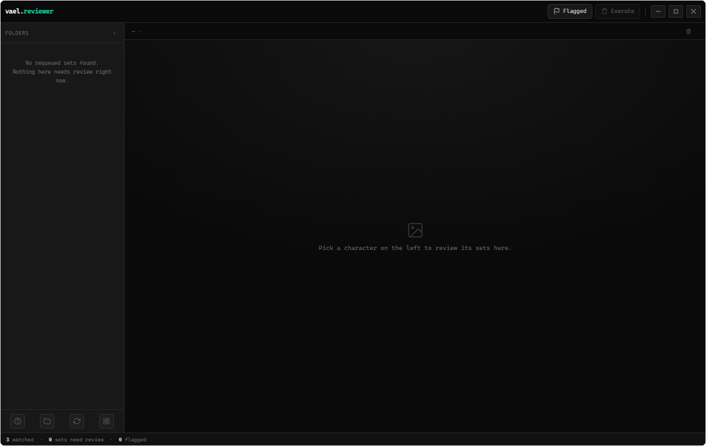

# reviewer

<!-- cover -->


---

A desktop image reviewer for sorting through generated variations. Group repeated versions of an image, compare them, and decide what to keep, trash, or flag for another run.

---

## features

- watch several folders and scan their subfolders
- group numbered image iterations into sets for review
- switch to General review to browse single images as well
- avoid duplicate results from overlapping watched folders
- hide unwanted folders from the review
- mark individual images or whole sets for trash
- send marked files to the system trash after confirmation
- retain failed trash marks for retry and show the affected filenames
- flag sets for another generation pass and view them together
- automatically flag sets when every image is marked
- keep flags after trash execution until you clear them
- open a larger focus view and step through a set's images
- choose whether right-click marks images or flags sets
- background scans and visible-area thumbnail loading
- remember window position, size, and zoom

Flags are reminders inside Reviewer; they do not automatically send jobs to ComfyUI or Cover.

---

## installation & removal

**Install from this repository**

1. Install [Node.js](https://nodejs.org/) with its included `npm` tool.
2. Download Vael using **Code → Download ZIP** on GitHub, then extract it.
3. Open the `reviewer` folder in a terminal. On Windows, open the folder in File Explorer, type `powershell` in the address bar, and press Enter.
4. Run these commands one at a time:

```text
npm install
npm start
```

The first command downloads the app's dependencies and needs internet access. For later launches, open a terminal in the same folder and run `npm start`. This opens a desktop window; opening the HTML file in a browser does not provide the complete app.

**Uninstall**

Close the app and delete its `reviewer` folder, including `node_modules`. If you installed a packaged Windows version, use **Settings → Apps** to uninstall it; for a Linux AppImage, delete the AppImage. To remove saved preferences too, delete only this app's data folder listed below. Keep any images you have stored inside the installation folder before deleting it.

---

## local data

The app's data folder is named `vael-reviewer` or `reviewer.`, depending on whether you launched the repository version or a packaged app.

- **Windows:** press **Win+R**, enter `%APPDATA%`, and find that app folder.
- **Linux:** look under `~/.config/` (or your custom `XDG_CONFIG_HOME`).
- **macOS:** look under `~/Library/Application Support/` if running from source.

The file `vael-reviewer-config.json` in that folder stores watched folders, folder visibility settings, and window state.

Marks, requeue flags, and thumbnail caches last only while the app is running. They are not restored after closing. Original images stay in their watched folders until you confirm a trash operation; removing a watched folder from the app does not delete it.

---

## file structure

```text
reviewer.html       — the interface and review controls
main.js             — desktop window, settings, file access, and trash
preload.js          — connection between the interface and desktop features
scanner.js          — background folder scanning
previews.js         — thumbnail loading and caching
preview-worker.js   — background thumbnail generation
package.json        — app information and launch/package commands
package-lock.json   — exact dependency versions
reviewer.md         — this guide
icon.png / .ico     — app icons
cover.png           — the cover image above
```
